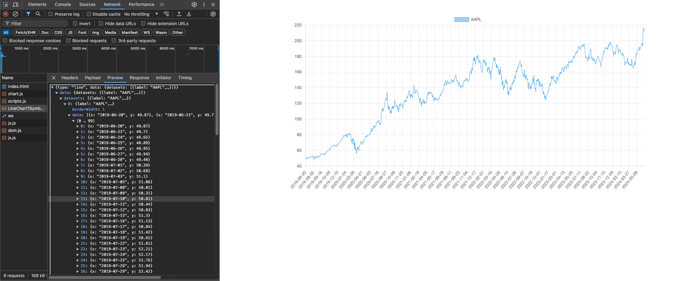

# XData Server for Charting with ChartJS in Web Applications

This repository consists of three projects:

- **XData Server**: Delivers stock information from an **SQLite** database. In addition, data can be requested in a format that can be used to create charts with ChartJS.
- **Vanilla JavaScript Application**: To show that XData is a universal solution, we will use a vanilla JavaScript application with Bootstrap to test the server.
- **TMS WEB Core Web Application**: In comparison, the same web application will be implemented using TMS WEB Core and Object Pascal.

The associated **video series** can be watched for **FREE** on the YouTube channel from [TMS Software](https://www.youtube.com/tmssoftwaretv). 

It is divided into several parts:

1. 
2.
3.